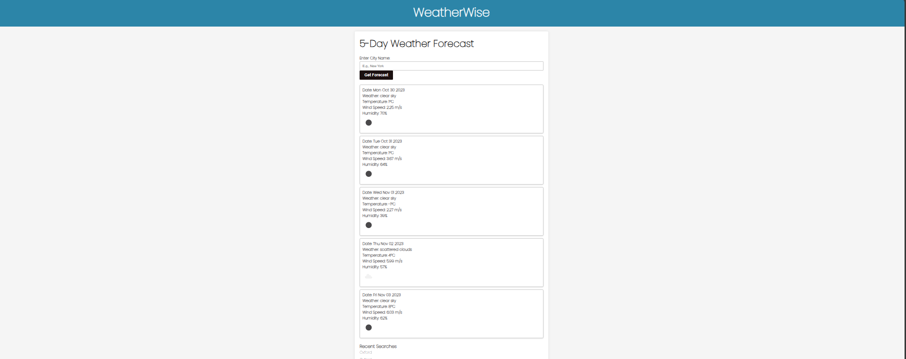

# weatherwise

## Table of Contents
-Overview 
-Features
-Usage
-Technologies
-Screenshot
-Link

## Overview
The Weather Dashboard is a web application that allows users to search for the current and future weather conditions for a city. Users can view the current weather conditions, including the city name, date, weather icon, temperature, humidity, and wind speed. Additionally, users can access a 5-day weather forecast that displays the date, weather icon, temperature, wind speed, and humidity.

## Features
-**Search for a City: Users can search for a city using the form input.
-**Current Weather Conditions: Upon searching for a city, users are presented with the current weather conditions, including the city name, date, weather icon, temperature, humidity, and wind speed.
-**5-Day Forecast: Users can view a 5-day weather forecast that displays the date, weather icon, temperature, wind speed, and humidity.
-**Search History: When users search for a city, the city is added to the search history.
Clicking on a City: Users can click on a city in the search history to view current and future weather conditions for that city.

## Usage
Open the Weather Dashboard web application.
In the provided form input, search for a city by entering the city name and submitting the form.
View the current weather conditions for the searched city, including the city name, date, weather icon, temperature, humidity, and wind speed.
Access the 5-day weather forecast to see the date, weather icon, temperature, wind speed, and humidity for the upcoming days.
The searched city is added to the search history.
Click on a city in the search history to view the current and future weather conditions for that city.

## Technologies
HTML
CSS
JavaScript
Weather API (for fetching weather data)
Local Storage (for storing search history)

## License
This project is licensed under the MIT License.

## Sreenshot

## Link
https://github.com/sarahizar/weatherwise